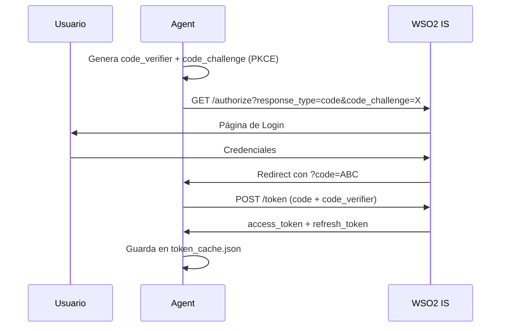
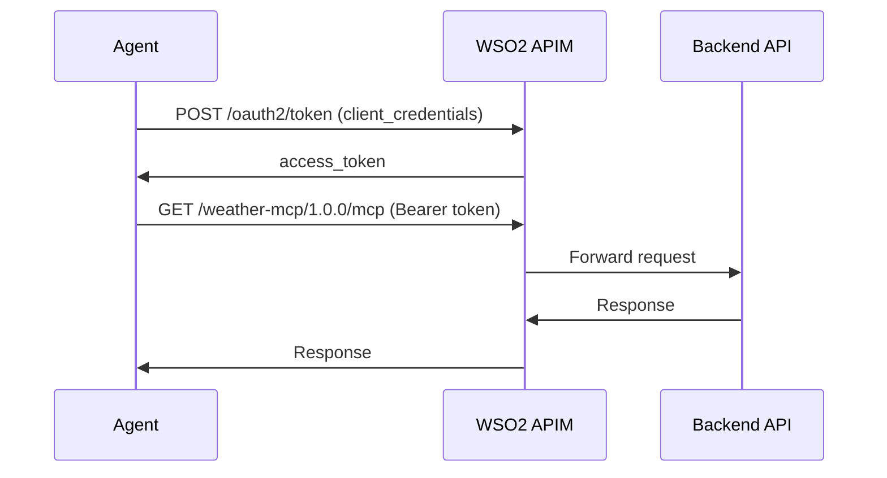

# Arquitectura Tecnológica - AI Shopify Agent con MCP

## Diagrama de Arquitectura

```mermaid
flowchart TB
    subgraph Usuario["👤 Usuario"]
        CLI["Terminal/CLI"]
    end

    subgraph AgentLayer["🤖 Capa Agente IA"]
        Agent["agent_gpt4.py<br/>(Semantic Kernel 1.37)"]
        SK["Semantic Kernel<br/>Python SDK"]
        Banners["Banners Module<br/>(UI Terminal)"]
    end

    subgraph MCPLayer["🔌 Model Context Protocol (MCP)"]
        subgraph WeatherMCP["Weather MCP Server"]
            WMCP["weather_mcp_openmeteo.py<br/>(FastMCP + FastAPI)"]
            OpenMeteo["Open-Meteo API<br/>(Weather Data)"]
        end
        subgraph OBSMCP["OBS MCP Server"]
            OBS_MCP["obs-mcp.js<br/>(Node.js MCP SDK)"]
            OBS_Bridge["OBS WebSocket Bridge<br/>:8888"]
            OBS["OBS Studio"]
        end
    end

    subgraph WSO2Layer["🔐 WSO2 Security & API Management"]
        subgraph WSO2IS["WSO2 Identity Server 7.1"]
            IS_Auth["Authorization Endpoint<br/>:9443/oauth2/authorize"]
            IS_Token["Token Endpoint<br/>:9443/oauth2/token"]
            IS_UserStore["User Store<br/>(LDAP/DB)"]
            IS_PKCE["PKCE Support"]
            IS_Scopes["Custom Scopes:<br/>update_prices, update_descriptions,<br/>view_products, offline_access"]
        end
        
        subgraph WSO2APIM["WSO2 API Manager 4.6"]
            APIM_GW["API Gateway<br/>:8253 (HTTPS)"]
            APIM_Token["Token Service<br/>:9453/oauth2/token"]
            APIM_Publisher["API Publisher"]
            
            subgraph APIs["APIs Publicadas"]
                OpenAI_API["OpenAI API<br/>/openaiapi/2.3.0"]
                Weather_API["Weather MCP API<br/>/weather-mcp/1.0.0"]
            end
        end
    end

    subgraph ExternalServices["☁️ Servicios Externos"]
        OpenAI["OpenAI API<br/>(GPT-4o-mini)"]
        Shopify["Shopify Admin API<br/>(GraphQL 2024-01)"]
    end

    subgraph DataLayer["💾 Datos Locales"]
        TokenCache["token_cache.json<br/>(OAuth Tokens)"]
        EnvFile[".env<br/>(Configuración)"]
        ShopifyOAS["shopify_admin_subset_oas.yaml<br/>(OpenAPI Spec)"]
    end

    %% Flujo principal
    CLI -->|"Comandos"| Agent
    Agent --> SK
    Agent --> Banners
    
    %% Autenticación OAuth2
    Agent -->|"1. Authorization Code + PKCE"| IS_Auth
    IS_Auth -->|"Login Page"| Usuario
    Usuario -->|"Credenciales"| IS_UserStore
    IS_Auth -->|"2. Code"| Agent
    Agent -->|"3. Exchange Code"| IS_Token
    IS_Token -->|"4. Access + Refresh Token"| Agent
    IS_Token -.->|"Scopes"| IS_Scopes
    IS_Auth -.->|"PKCE Verify"| IS_PKCE
    
    %% Client Credentials para APIs
    Agent -->|"Client Credentials"| APIM_Token
    APIM_Token -->|"API Access Token"| Agent
    
    %% Llamadas a través del Gateway
    Agent -->|"Bearer Token"| APIM_GW
    APIM_GW --> OpenAI_API
    APIM_GW --> Weather_API
    OpenAI_API -->|"Proxy"| OpenAI
    Weather_API -->|"Proxy + Auth"| WMCP
    
    %% Weather MCP
    WMCP -->|"HTTP GET"| OpenMeteo
    
    %% OBS MCP (directo, sin APIM)
    Agent -.->|"stdio/SSE"| OBS_MCP
    OBS_MCP --> OBS_Bridge
    OBS_Bridge --> OBS
    
    %% Shopify (directo con token)
    Agent -->|"GraphQL + Access Token"| Shopify
    
    %% Datos locales
    Agent <-->|"Persist/Load"| TokenCache
    Agent <-->|"Config"| EnvFile
    Agent <-->|"API Schema"| ShopifyOAS

    %% Estilos
    classDef wso2 fill:#ff6b35,stroke:#333,color:white
    classDef mcp fill:#10b981,stroke:#333,color:white
    classDef external fill:#3b82f6,stroke:#333,color:white
    classDef agent fill:#8b5cf6,stroke:#333,color:white
    classDef data fill:#6b7280,stroke:#333,color:white
    
    class IS_Auth,IS_Token,IS_UserStore,IS_PKCE,IS_Scopes,APIM_GW,APIM_Token,APIM_Publisher,OpenAI_API,Weather_API wso2
    class WMCP,OBS_MCP,OBS_Bridge mcp
    class OpenAI,Shopify,OpenMeteo,OBS external
    class Agent,SK,Banners agent
    class TokenCache,EnvFile,ShopifyOAS data
```



## Componentes Principales

### 🤖 Agente IA (Python)

| Componente | Tecnología | Descripción |
|------------|------------|-------------|
| **agent_gpt4.py** | Python 3.14 | Agente principal con CLI interactivo |
| **Semantic Kernel** | v1.37.0 | Framework de orquestación de IA de Microsoft |
| **oauth2_apim.py** | httpx + requests | Cliente OAuth2 para WSO2 APIM |
| **banners/** | Python | Módulo de banners de retailers (El Corte Inglés, etc.) |

### 🔌 MCP Servers

| Server | Tecnología | Puerto | Función |
|--------|------------|--------|---------|
| **Weather MCP** | Python (FastMCP) | 8080 | Pronóstico meteorológico para recomendaciones de moda |
| **OBS MCP** | Node.js (MCP SDK) | stdio | Control de OBS Studio para demos en vivo |

### 🔐 WSO2 Identity Server 7.1

| Endpoint | Puerto | Función |
|----------|--------|---------|
| `/oauth2/authorize` | 9443 | Authorization Code + PKCE |
| `/oauth2/token` | 9443 | Token Exchange & Refresh |
| `/oauth2/userinfo` | 9443 | Información del usuario |

**Scopes configurados:**
- `openid` - OpenID Connect
- `update_prices` - Modificar precios en Shopify
- `update_descriptions` - Modificar descripciones
- `view_products` - Ver catálogo
- `offline_access` - Refresh tokens

### 🌐 WSO2 API Manager 4.6

| Endpoint | Puerto | Función |
|----------|--------|---------|
| Gateway HTTPS | 8253 | Proxy de APIs |
| Token Service | 9453 | Client Credentials OAuth2 |
| Publisher | 9453 | Gestión de APIs |

**APIs Publicadas:**
| API | Path | Backend |
|-----|------|---------|
| OpenAI API | `/openaiapi/2.3.0` | `https://api.openai.com/v1` |
| Weather MCP | `/weather-mcp/1.0.0` | `http://localhost:8080/mcp` |

### ☁️ Servicios Externos

| Servicio | Función |
|----------|---------|
| **OpenAI (GPT-4o-mini)** | Modelo LLM para razonamiento y recomendaciones |
| **Shopify Admin API** | GraphQL API para gestión de productos y colecciones |
| **Open-Meteo** | API gratuita de pronóstico meteorológico |
| **OBS Studio** | Software de streaming para demos |

## Flujos de Autenticación

### 1. Autenticación de Usuario (Authorization Code + PKCE)



### 2. Acceso a APIs (Client Credentials)



## Configuración (.env)

```bash
# WSO2 Identity Server
WSO2_AUTH_ENDPOINT=https://localhost:9443/oauth2/authorize
WSO2_TOKEN_ENDPOINT=https://localhost:9443/oauth2/token
WSO2_CONSUMER_KEY=<client_id_from_is>
WSO2_CONSUMER_SECRET=<client_secret_from_is>
WSO2_SCOPES=openid update_prices update_descriptions view_products offline_access

# WSO2 API Manager
WSO2_APIM_TOKEN_ENDPOINT=https://localhost:9453/oauth2/token
WSO2_APIM_CONSUMER_KEY=<client_id_from_apim>
WSO2_APIM_CONSUMER_SECRET=<client_secret_from_apim>
WSO2_OPENAI_API_URL=https://localhost:8253/openaiapi/2.3.0
WSO2_WEATHER_MCP_URL=https://localhost:9453/weather-mcp/1.0.0

# Shopify
SHOPIFY_STORE_URL=<store>.myshopify.com
SHOPIFY_ACCESS_TOKEN=shpat_xxxxx

# OpenAI (directo, para fallback)
OPENAI_API_KEY=sk-xxxxx
```

## Stack Tecnológico Completo

| Capa | Tecnologías |
|------|-------------|
| **Frontend** | Terminal CLI (Python) |
| **Agente IA** | Python 3.14, Semantic Kernel 1.37, OpenAI SDK |
| **MCP** | FastMCP (Python), MCP SDK (Node.js) |
| **Identity** | WSO2 IS 7.1 (OAuth2, OIDC, PKCE) |
| **API Management** | WSO2 APIM 4.6 (Gateway, Rate Limiting, Analytics) |
| **LLM** | GPT-4o-mini (OpenAI) |
| **E-commerce** | Shopify Admin GraphQL API 2024-01 |
| **Weather** | Open-Meteo API |
| **Streaming** | OBS Studio + WebSocket |
