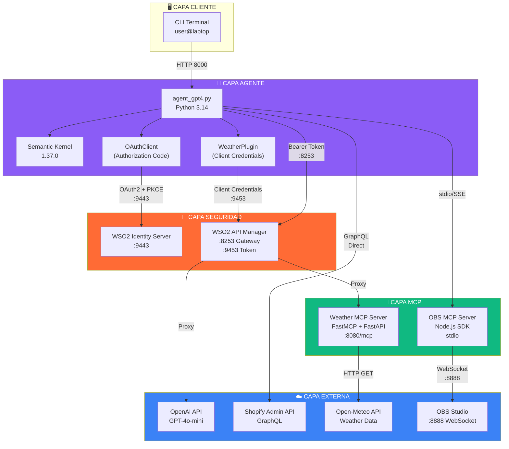
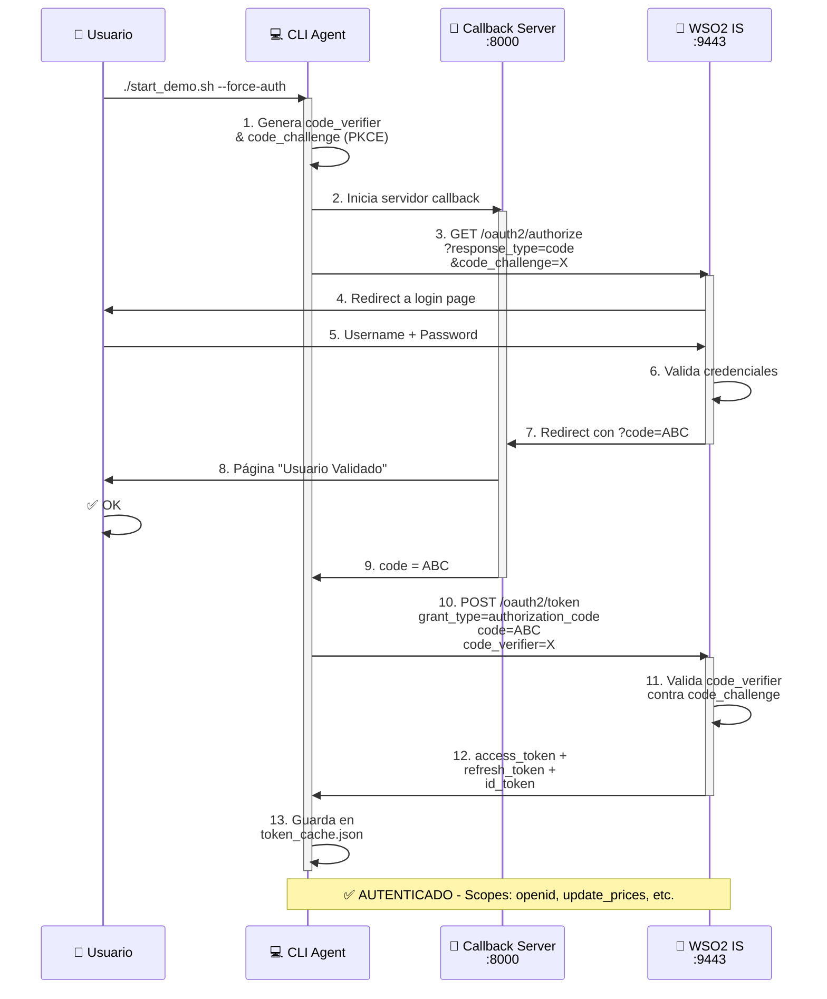
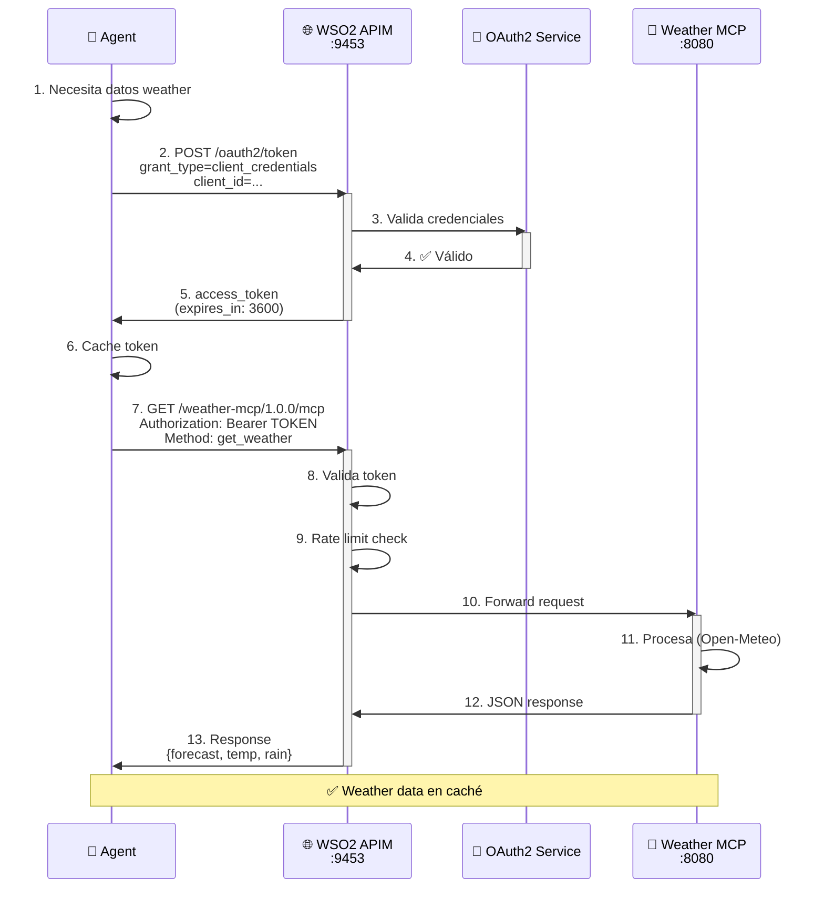
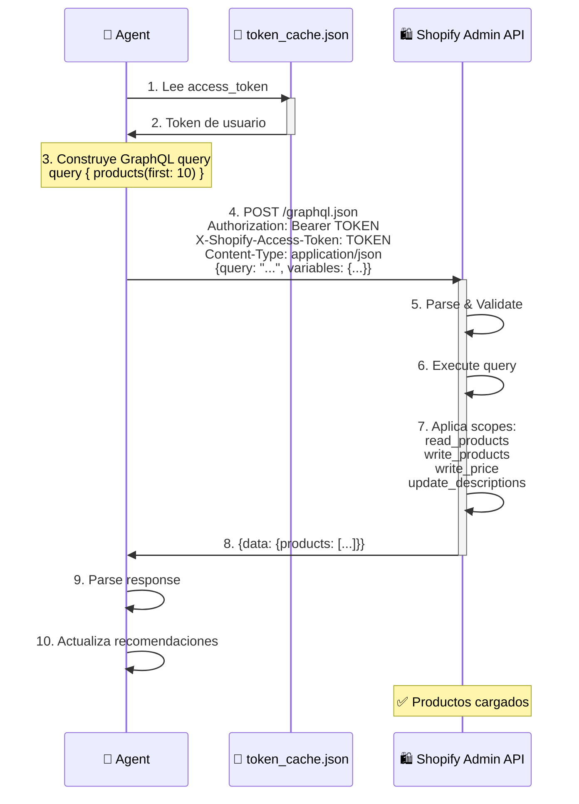
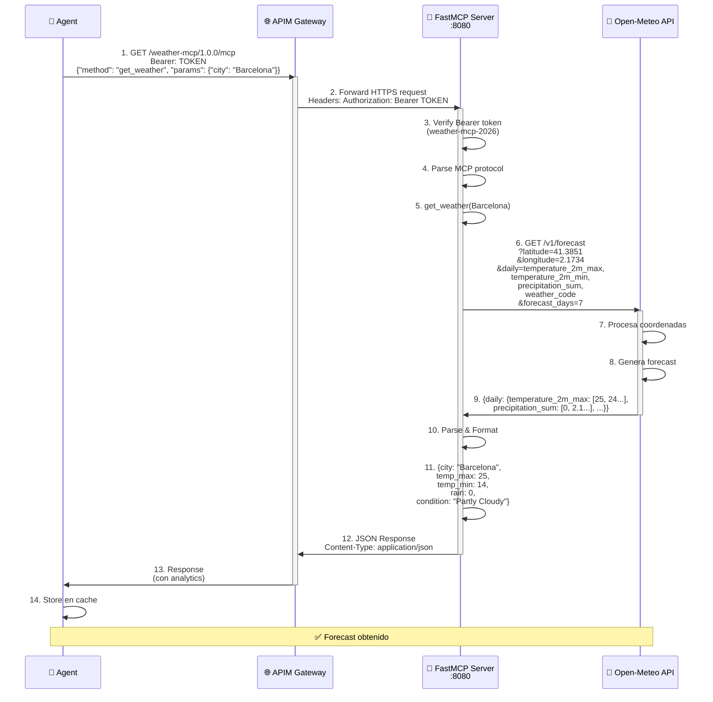
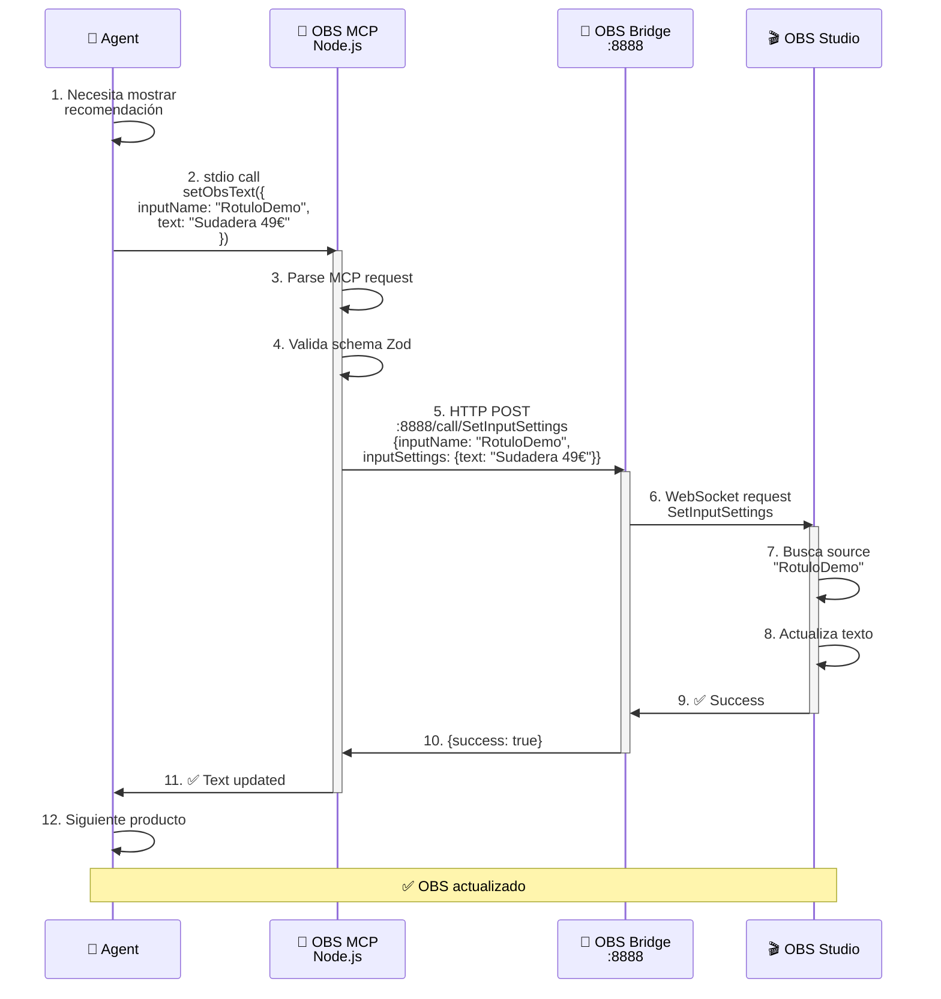
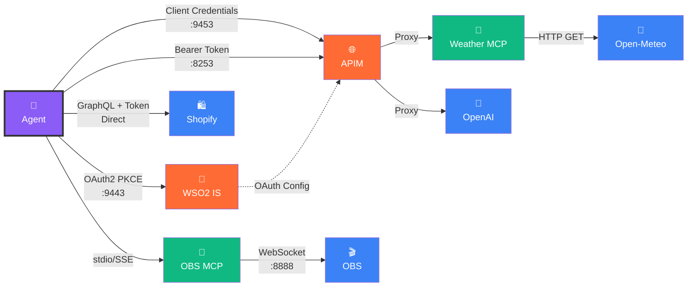
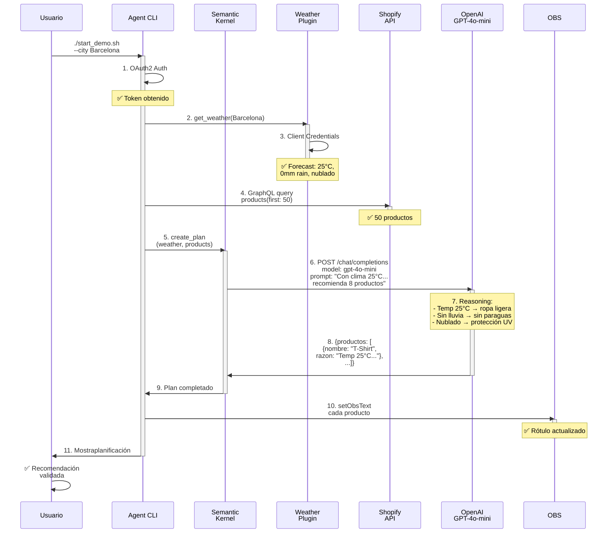

# Diagramas de Comunicaciones - AI Shopify Agent

## 1. Arquitectura General con Capas



---

## 2. Flujo OAuth2 (Authorization Code + PKCE)



---

## 3. Flujo Client Credentials (MCPs)



---

## 4. Flujo Shopify GraphQL



---

## 5. Flujo Weather MCP (Interno)



---

## 6. Flujo OBS MCP (Streaming)



---

## 7. Matriz de Comunicaciones



---

## 8. Tabla de Puertos y Protocolos

| Componente | Puerto | Protocolo | Tipo | Autenticación |
|------------|--------|-----------|------|---------------|
| **CLI Agent** | 8000 | HTTP | Callback OAuth | - |
| **Weather MCP** | 8080 | HTTP + FastAPI | MCP + HTTP | Bearer Token |
| **OBS Bridge** | 8888 | WebSocket | OBS Remote | Token |
| **WSO2 IS** | 9443 | HTTPS | OAuth2, OIDC | Creds |
| **WSO2 APIM Token** | 9453 | HTTPS | OAuth2 | Basic Auth |
| **APIM Gateway** | 8253 | HTTPS | REST/GraphQL | Bearer Token |
| **Shopify Admin** | 443 | HTTPS | GraphQL | Bearer Token |
| **OpenAI** | 443 | HTTPS | REST | Bearer Token |
| **Open-Meteo** | 443 | HTTPS | REST | - (libre) |
| **OBS Studio** | 4455 | WebSocket | OBS Protocol | Token |

---

## 9. Flujo Completo: Recomendación de Productos



---

## 10. Stack de Puertos - Vista General

```
┌─────────────────────────────────────────────────────────┐
│                    🖥️ USUARIO (localhost)               │
└─────────────────────────────────────────────────────────┘
                              │
                    ┌─────────┼─────────┐
                    ↓         ↓         ↓
        ┌─────────────────┐ ┌────────────────┐ ┌────────┐
        │ CLI Callback    │ │ Weather MCP    │ │OBS WS  │
        │ :8000 (HTTP)    │ │ :8080 (HTTP)   │ │:8888   │
        └────────┬────────┘ └────────┬───────┘ └────┬───┘
                 │                   │               │
        ┌────────▼────────────────────▼───────────────▼────┐
        │      🔐 WSO2 APIM GATEWAY (:8253 HTTPS)         │
        │  ┌─────────────────────────────────────────┐    │
        │  │ - OAuth2 Proxy                          │    │
        │  │ - Rate Limiting, Analytics              │    │
        │  │ - API Routing                           │    │
        │  └──────┬─────────────────┬────────────────┘    │
        └─────────┼─────────────────┼──────────────────────┘
                  │                 │
    ┌─────────────▼────┐  ┌────────▼──────────────┐
    │ 🔐 WSO2 IS       │  │ ☁️ External APIs      │
    │ OAuth2 + Token   │  │  (OpenAI, Shopify,   │
    │ :9443 HTTPS      │  │   Open-Meteo)        │
    │ :9453 HTTPS      │  │ :443 HTTPS           │
    └──────────────────┘  └──────────────────────┘
```
