# Diagramas de Comunicaciones - AI Shopify Agent

## 1. Arquitectura General con Capas


---

## 2. Flujo OAuth2 (Authorization Code + PKCE)

```mermaid
sequenceDiagram
    participant User as 👤 Usuario
    participant CLI as 💻 CLI Agent
    participant CB as 🔄 Callback Server<br/>:8000
    participant IS as 🔐 WSO2 IS<br/>:9443
    
    User->>CLI: ./start_demo.sh --force-auth
    activate CLI
    
    CLI->>CLI: 1. Genera code_verifier<br/>& code_challenge (PKCE)
    CLI->>CB: 2. Inicia servidor callback
    activate CB
    
    CLI->>IS: 3. GET /oauth2/authorize<br/>?response_type=code<br/>&code_challenge=X
    activate IS
    
    IS->>User: 4. Redirect a login page
    User->>IS: 5. Username + Password
    IS->>IS: 6. Valida credenciales
    
    IS->>CB: 7. Redirect con ?code=ABC
    deactivate IS
    
    CB->>User: 8. Página "Usuario Validado"
    User->>User: ✅ OK
    
    CB->>CLI: 9. code = ABC
    deactivate CB
    
    CLI->>IS: 10. POST /oauth2/token<br/>grant_type=authorization_code<br/>code=ABC<br/>code_verifier=X
    activate IS
    
    IS->>IS: 11. Valida code_verifier<br/>contra code_challenge
    IS->>CLI: 12. access_token +<br/>refresh_token +<br/>id_token
    deactivate IS
    
    CLI->>CLI: 13. Guarda en<br/>token_cache.json
    deactivate CLI
    
    Note over CLI,IS: ✅ AUTENTICADO - Scopes: openid, update_prices, etc.
```



---

## 3. Flujo Client Credentials (MCPs)

```mermaid
sequenceDiagram
    participant Agent as 🤖 Agent
    participant APIM as 🌐 WSO2 APIM<br/>:9453
    participant OAuth as 🔐 OAuth2 Service
    participant MCP as 🔌 Weather MCP<br/>:8080
    
    Agent->>Agent: 1. Necesita datos weather
    
    Agent->>APIM: 2. POST /oauth2/token<br/>grant_type=client_credentials<br/>client_id=...
    activate APIM
    
    APIM->>OAuth: 3. Valida credenciales
    activate OAuth
    OAuth->>APIM: 4. ✅ Válido
    deactivate OAuth
    
    APIM->>Agent: 5. access_token<br/>(expires_in: 3600)
    deactivate APIM
    
    Agent->>Agent: 6. Cache token
    
    Agent->>APIM: 7. GET /weather-mcp/1.0.0/mcp<br/>Authorization: Bearer TOKEN<br/>Method: get_weather
    activate APIM
    
    APIM->>APIM: 8. Valida token
    APIM->>APIM: 9. Rate limit check
    APIM->>MCP: 10. Forward request
    activate MCP
    
    MCP->>MCP: 11. Procesa (Open-Meteo)
    MCP->>APIM: 12. JSON response
    deactivate MCP
    
    APIM->>Agent: 13. Response<br/>{forecast, temp, rain}
    deactivate APIM
    
    Note over Agent,MCP: ✅ Weather data en caché
```



---

## 4. Flujo Shopify GraphQL (vía APIM)

```mermaid
sequenceDiagram
    participant Agent as 🤖 Agent
    participant APIM as 🌐 APIM Gateway<br/>:8253
    participant Shopify as 🛍️ Shopify Admin API
    
    Agent->>Agent: 1. Construye GraphQL query<br/>query { products(first: 10) }
    
    Agent->>APIM: 2. POST /shopify-admin/graphql.json<br/>Authorization: Bearer TOKEN<br/>Content-Type: application/json<br/>{query: "...", variables: {...}}
    activate APIM
    
    APIM->>APIM: 3. Valida Bearer token<br/>(OAuth2 Client Credentials)
    APIM->>APIM: 4. Rate limit check
    APIM->>APIM: 5. Analytics & Logging
    
    APIM->>Shopify: 6. POST /admin/api/2024-01/graphql.json<br/>X-Shopify-Access-Token: SHOPIFY_TOKEN<br/>{query: "...", variables: {...}}
    activate Shopify
    
    Shopify->>Shopify: 7. Parse & Validate
    Shopify->>Shopify: 8. Execute query
    Shopify->>Shopify: 9. Aplica scopes:<br/>read_products<br/>write_products<br/>update_descriptions
    
    Shopify->>APIM: 10. {data: {products: [...]}}
    deactivate Shopify
    
    APIM->>Agent: 11. Response<br/>(con headers de APIM)
    deactivate APIM
    
    Agent->>Agent: 12. Parse response
    Agent->>Agent: 13. Actualiza recomendaciones
    
    Note over Shopify,Agent: ✅ Productos cargados a través de APIM
```



---

## 5. Flujo Weather MCP (Interno)

```mermaid
sequenceDiagram
    participant Agent as 🤖 Agent
    participant APIM as 🌐 APIM Gateway
    participant MCP as 🔌 FastMCP Server<br/>:8080
    participant OM as 📡 Open-Meteo API
    
    Agent->>APIM: 1. GET /weather-mcp/1.0.0/mcp<br/>Bearer: TOKEN<br/>{"method": "get_weather", "params": {"city": "Barcelona"}}
    activate APIM
    
    APIM->>MCP: 2. Forward HTTPS request<br/>Headers: Authorization: Bearer TOKEN
    activate MCP
    
    MCP->>MCP: 3. Verify Bearer token<br/>(weather-mcp-2026)
    MCP->>MCP: 4. Parse MCP protocol
    MCP->>MCP: 5. get_weather(Barcelona)
    
    MCP->>OM: 6. GET /v1/forecast<br/>?latitude=41.3851<br/>&longitude=2.1734<br/>&daily=temperature_2m_max,<br/>temperature_2m_min,<br/>precipitation_sum,<br/>weather_code<br/>&forecast_days=7
    activate OM
    
    OM->>OM: 7. Procesa coordenadas
    OM->>OM: 8. Genera forecast
    
    OM->>MCP: 9. {daily: {temperature_2m_max: [25, 24...],<br/>precipitation_sum: [0, 2.1...], ...}}
    deactivate OM
    
    MCP->>MCP: 10. Parse & Format
    MCP->>MCP: 11. {city: "Barcelona",<br/>temp_max: 25,<br/>temp_min: 14,<br/>rain: 0,<br/>condition: "Partly Cloudy"}
    
    MCP->>APIM: 12. JSON Response<br/>Content-Type: application/json
    deactivate MCP
    
    APIM->>Agent: 13. Response<br/>(con analytics)
    deactivate APIM
    
    Agent->>Agent: 14. Store en cache
    
    Note over OM,Agent: ✅ Forecast obtenido
```



---

## 6. Flujo OBS MCP (Streaming)

```mermaid
sequenceDiagram
    participant Agent as 🤖 Agent
    participant OBS_MCP as 🔌 OBS MCP<br/>Node.js
    participant Bridge as 🌉 OBS Bridge<br/>:8888
    participant OBS as 🎬 OBS Studio
    
    Agent->>Agent: 1. Necesita mostrar<br/>recomendación
    
    Agent->>OBS_MCP: 2. stdio call<br/>setObsText({<br/>inputName: "RotuloDemo",<br/>text: "Sudadera 49€"<br/>})
    activate OBS_MCP
    
    OBS_MCP->>OBS_MCP: 3. Parse MCP request
    OBS_MCP->>OBS_MCP: 4. Valida schema Zod
    
    OBS_MCP->>Bridge: 5. HTTP POST<br/>:8888/call/SetInputSettings<br/>{inputName: "RotuloDemo",<br/>inputSettings: {text: "Sudadera 49€"}}
    activate Bridge
    
    Bridge->>OBS: 6. WebSocket request<br/>SetInputSettings
    activate OBS
    
    OBS->>OBS: 7. Busca source<br/>"RotuloDemo"
    OBS->>OBS: 8. Actualiza texto
    
    OBS->>Bridge: 9. ✅ Success
    deactivate OBS
    
    Bridge->>OBS_MCP: 10. {success: true}
    deactivate Bridge
    
    OBS_MCP->>Agent: 11. ✅ Text updated
    deactivate OBS_MCP
    
    Agent->>Agent: 12. Siguiente producto
    
    Note over OBS,Agent: ✅ OBS actualizado
```



---

## 7. Matriz de Comunicaciones

```mermaid
graph LR
    Agent["🤖<br/>Agent"]
    IS["🔐<br/>WSO2 IS"]
    APIM["🌐<br/>APIM"]
    Weather["🔌<br/>Weather MCP"]
    OBS_MCP["🔌<br/>OBS MCP"]
    Shopify["🛍️<br/>Shopify"]
    OpenAI["🤖<br/>OpenAI"]
    OpenMeteo["📡<br/>Open-Meteo"]
    OBS["🎬<br/>OBS"]
    
    Agent -->|OAuth2 PKCE<br/>:9443| IS
    Agent -->|Client Credentials<br/>:9453| APIM
    Agent -->|Bearer Token<br/>:8253| APIM
    Agent -->|stdio/SSE| OBS_MCP
    
    APIM -->|Proxy| OpenAI
    APIM -->|Proxy| Weather
    APIM -->|Proxy| Shopify
    
    Weather -->|HTTP GET| OpenMeteo
    
    OBS_MCP -->|WebSocket<br/>:8888| OBS
    
    IS -.->|OAuth Config| APIM
    
    style Agent fill:#8b5cf6,color:#fff,stroke:#333,stroke-width:3px
    style IS fill:#ff6b35,color:#fff
    style APIM fill:#ff6b35,color:#fff
    style Weather fill:#10b981,color:#fff
    style OBS_MCP fill:#10b981,color:#fff
    style Shopify fill:#3b82f6,color:#fff
    style OpenAI fill:#3b82f6,color:#fff
    style OpenMeteo fill:#3b82f6,color:#fff
    style OBS fill:#3b82f6,color:#fff
```



---

## 8. Tabla de Puertos y Protocolos

| Componente | Puerto | Protocolo | Tipo | Autenticación |
|------------|--------|-----------|------|---------------|
| **CLI Agent** | 8000 | HTTP | Callback OAuth | - |
| **Weather MCP** | 8080 | HTTP + FastAPI | MCP + HTTP | Bearer Token |
| **OBS Bridge** | 8888 | WebSocket | OBS Remote | Token |
| **WSO2 IS** | 9443 | HTTPS | OAuth2, OIDC | Creds |
| **WSO2 APIM Token** | 9453 | HTTPS | OAuth2 | Basic Auth |
| **APIM Gateway** | 8253 | HTTPS | REST/GraphQL | Bearer Token |
| **Shopify Admin** | 443 | HTTPS | GraphQL | Bearer Token |
| **OpenAI** | 443 | HTTPS | REST | Bearer Token |
| **Open-Meteo** | 443 | HTTPS | REST | - (libre) |
| **OBS Studio** | 4455 | WebSocket | OBS Protocol | Token |

---

## 9. Flujo Completo: Recomendación de Productos

```mermaid
sequenceDiagram
    participant U as Usuario
    participant CLI as Agent CLI
    participant SK as Semantic<br/>Kernel
    participant Weather as Weather<br/>Plugin
    participant Shopify as Shopify<br/>API
    participant OpenAI as OpenAI<br/>GPT-4o-mini
    participant OBS as OBS
    
    U->>CLI: ./start_demo.sh<br/>--city Barcelona
    activate CLI
    
    CLI->>CLI: 1. OAuth2 Auth
    Note over CLI: ✅ Token obtenido
    
    CLI->>Weather: 2. get_weather(Barcelona)
    activate Weather
    Weather->>Weather: 3. Client Credentials
    Note over Weather: ✅ Forecast: 25°C,<br/>0mm rain, nublado
    deactivate Weather
    
    CLI->>CLI: 4. Obtiene token APIM<br/>(Client Credentials)
    
    CLI->>APIM: 5. GraphQL query<br/>POST /shopify-admin/graphql.json
    activate APIM
    APIM->>Shopify: Forward request
    activate Shopify
    Note over Shopify: ✅ 50 productos
    Shopify->>APIM: Response
    deactivate Shopify
    APIM->>CLI: Response
    deactivate APIM
    
    CLI->>SK: 7. create_plan<br/>(weather, products)
    activate SK
    
    SK->>APIM: 8. POST /openaiapi/2.3.0/chat/completions<br/>model: gpt-4o-mini<br/>Bearer: TOKEN<br/>prompt: "Con clima 25°C...<br/>recomienda 8 productos"
    activate APIM
    
    APIM->>OpenAI: Forward to OpenAI
    activate OpenAI
    
    Note over OpenAI: 9. Reasoning:<br/>- Temp 25°C → ropa ligera<br/>- Sin lluvia → sin paraguas<br/>- Nublado → protección UV
    
    OpenAI->>APIM: 10. {choices: [...]}<br/>
    deactivate OpenAI
    
    APIM->>SK: 11. Response
    deactivate APIM
    
    SK->>CLI: 12. Plan completado
    deactivate SK
    
    CLI->>OBS: 13. setObsText<br/>cada producto
    activate OBS
    Note over OBS: ✅ Rótulo actualizado
    deactivate OBS
    
    CLI->>U: 14SK
    
    CLI->>OBS: 10. setObsText<br/>cada producto
    activate OBS
    Note over OBS: ✅ Rótulo actualizado
    deactivate OBS
    
    CLI->>U: 11. Mostraplanificación
    deactivate CLI
    
    U->>U: ✅ Recomendación<br/>validada
```



---

## 10. Stack de Puertos - Vista General

```
┌─────────────────────────────────────────────────────────┐
│                    🖥️ USUARIO (localhost)               │
└─────────────────────────────────────────────────────────┘
                              │
                    ┌─────────┼─────────┐
                    ↓         ↓         ↓
        ┌─────────────────┐ ┌────────────────┐ ┌────────┐
        │ CLI Callback    │ │ Weather MCP    │ │OBS WS  │
        │ :8000 (HTTP)    │ │ :8080 (HTTP)   │ │:8888   │
        └────────┬────────┘ └────────┬───────┘ └────┬───┘
                 │                   │               │
        ┌────────▼────────────────────▼───────────────▼────┐
        │      🔐 WSO2 APIM GATEWAY (:8253 HTTPS)         │
        │  ┌─────────────────────────────────────────┐    │
        │  │ - OAuth2 Proxy                          │    │
        │  │ - Rate Limiting, Analytics              │    │
        │  │ - API Routing                           │    │
        │  └──────┬─────────────────┬────────────────┘    │
        └─────────┼─────────────────┼──────────────────────┘
                  │                 │
    ┌─────────────▼────┐  ┌────────▼──────────────┐
    │ 🔐 WSO2 IS       │  │ ☁️ External APIs      │
    │ OAuth2 + Token   │  │  (OpenAI, Shopify,   │
    │ :9443 HTTPS      │  │   Open-Meteo)        │
    │ :9453 HTTPS      │  │ :443 HTTPS           │
    └──────────────────┘  └──────────────────────┘
```
