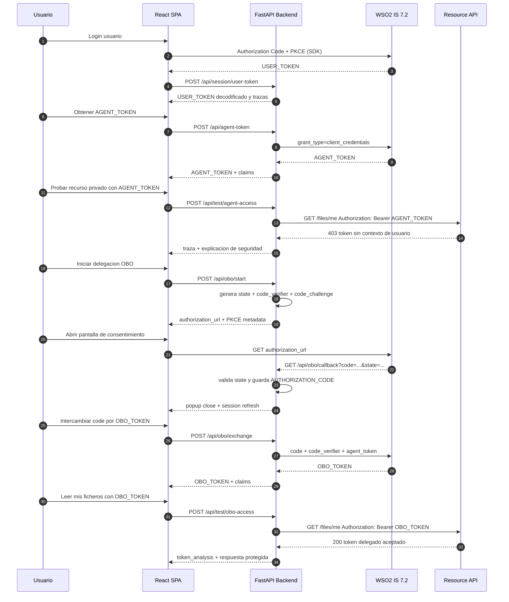

# Sequence Flow

## Lectura del diagrama

- `USER_TOKEN` pertenece al canal SPA <-> IS.
- `AGENT_TOKEN` pertenece al canal Backend <-> IS.
- `AUTHORIZATION_CODE` es temporal y solo sirve como entrada del exchange.
- `OBO_TOKEN` es el artefacto delegado que el backend usa frente a la Resource API.
